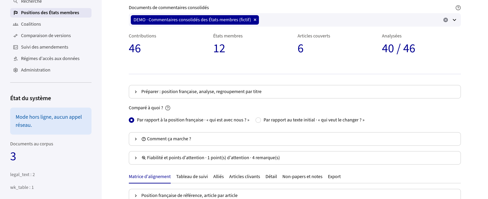

# mariasol

**An instrument for analysing European legislative negotiation — designed under an institutional constraint.**

[](https://github.com/marisoldenazelle/mariasol/actions/workflows/ci.yml)
[](LICENSE)
[](requirements.txt)

Mapping where twenty-seven member states stand on a draft regulation, article by
article, is done by hand: one analyst, one spreadsheet, several days per
consolidated comments table from a Council working party. By the time the map is
finished the presidency has circulated a new compromise text.

This tool builds that map from the primary documents, and makes every cell of it
contestable on the evidence. It was written inside a French ministry directorate
for its own negotiators, under constraints that are the interesting part of the
problem: the documents may not leave the machine, the arithmetic must be
reproducible by hand, and nothing a language model asserts may stand without a
quotation that a program — not the model — has found in the source.


<sub>The amending-act reader, running on the synthetic corpus shipped with this
repository. The interface is in French: it was built for French civil
servants.</sub>

---

## Three design commitments

These are the point of the project. Everything else follows from them.

### Computation is deterministic; the model only qualifies

Alignment matrices, pairwise agreement rates, coalition detection,
qualified-majority arithmetic, version diffs, amending-act parsing — all of it is
arithmetic and pattern analysis, reproducible by hand on any single case. The
language model never computes and never decides. It is asked one question only:
*given this passage and this reference position, what kind of divergence is
this?* An analyst who disagrees with an answer can open the contribution, read
the quotation the model relied on, and overrule it; overruling the French
reference position reclassifies the whole article.

This matters beyond engineering taste. A negotiator who cannot reconstruct why a
state appears in the "opposed" column will not use the number, and should not.

### Grounding is extractive, and enforced by the program

Every claim the model produces carries a quotation. The program then searches for
that quotation *verbatim* in the source document. Claims whose quotation cannot
be found are **discarded, not flagged** — the analyst never sees them.

The trade-off is explicit and instrumented: this buys precision with recall, and
the number of discarded claims is displayed on screen next to every answer. A
high count is not a bug report, it is a signal that the model is extrapolating on
that question. Nothing here makes hallucination impossible; what it does is make
unsupported assertions non-viable, and make the cost of that choice visible.

### Retrieval is lexical by necessity, not by default

The index is SQLite FTS5 with BM25 ranking — sparse retrieval, no embeddings.
That is a governance decision wearing technical clothes. Building a vector index
means sending an entire corpus of restricted negotiation documents to an
embedding endpoint, once. For documents circulated under distribution
restrictions, that single operation is the whole question.

Inference runs against a state-operated model endpoint hosted under national
security qualification, or against any OpenAI-compatible endpoint, or not at
all: in offline mode, import, indexing, full-text search, version comparison,
amending-act parsing and every coalition calculation remain fully functional. The
sovereignty constraint determined the architecture, rather than being bolted onto
it afterwards.

---

## The documents

The central task is one document: the **consolidated comments table** that a
Council working party circulates. Delegations submit written comments and
drafting suggestions, the presidency compiles them article by article, and the
result runs to several hundred pages of prose, in English, with no structure a
machine reads directly. Turning that document into a position matrix is what
this tool is for; everything else exists around it.

These tables come in two shapes depending on the stage of the file. Early on,
two columns: *Commission proposal | drafting suggestions and comments*. Once a
presidency compromise exists, three: *proposal | presidency text | comments*.
The parser reads the first and the last column and never the middle one — on a
three-column table the middle column holds the compromise text, and reading it
as comments loses every contribution on the page.

The corpus is not limited to those tables. The same pipeline ingests presidency
compromise texts, non-papers and white papers from individual delegations,
meeting reports, consolidated regulations fetched from EUR-Lex, and amending
acts. Document type is detected on import and can be corrected by hand; it
decides which treatment applies. A non-paper yields positions only where it
expresses one — a passage of courtesy or procedure yields none. An amending act
gets its own reader, because it does not contain the text it changes.

## What it does

| | |
|---|---|
| **Position mapping** | Classifies each written contribution — aligned, partially aligned, divergent — against a reference position, and builds the article × member state matrix. |
| **Two reference frames** | *Against the national position* answers "who is with us"; *against the initial text* answers "who wants to change it, ourselves included". On an article the delegation did not amend the two coincide, because not amending counts as acceptance. |
| **Coalition arithmetic** | Pairwise agreement, bloc detection on a graph, and Council arithmetic: qualified majority (15 of 27 states and 65 % of population) and blocking minority (at least 4 states and more than 35 %). |
| **Amending acts** | An omnibus does not rewrite a regulation, it states what to change in it. The reader parses those instructions, groups them by target act and target article, reconstructs each article before and after, and compares two versions of the same omnibus instruction by instruction. |
| **Sourced search** | A question in French, an answer in which every assertion cites a passage located verbatim in the corpus. |
| **Deliverables** | Word note and Excel workbook, both editable, in the format the directorate already uses. Not screenshots — real tables. |

More on each, and on why each is built the way it is, in
**[docs/METHOD.md](docs/METHOD.md)**.



---

## Run it

No credentials, no restricted document, no network:

```bash
pip install -r requirements.txt -r requirements-dev.txt
python examples/make_demo_corpus.py      # a fictional regulation, omnibus and comments table
streamlit run app.py
```

The development requirements are included because the demo corpus writer needs
them; `requirements.txt` alone is enough to run the application on real
documents.

The demo corpus is entirely synthetic — no real text, no real delegation, no real
position — but it is parsed by exactly the same code path as a real Commission
proposal, including the drafting conventions the amending-act reader targets.
Position classification runs in its offline lexical mode, so the matrix and the
coalition arithmetic fill up without any model.

To use a model, copy `.env.example` to `.env` and set a key. See
[docs/fr/DEMARRAGE.md](docs/fr/DEMARRAGE.md) for the step-by-step install guide
(French).

---

## What it does not do

It does not state the law. It does not predict an outcome: written positions in a
working party are not votes, and Council arithmetic says what a distribution
*would* give if it transposed into a vote, which never happens as such.

It does not replace reading the documents — it says where to read, and quotes
what it relies on. A classification is meant to be contested: the contribution,
the retained quotation and the full text are two clicks away.

And the qualification of a change's significance is model-produced, therefore
contestable on the evidence. On one real amending act the model classified 30 of
36 articles as "major", which is a ranking that ranks nothing; the screen now
says so itself when that proportion exceeds 60 %. That episode, and the others,
are in **[docs/EVALUATION.md](docs/EVALUATION.md)**.

---

## Repository

```
app.py, accueil.py     entry point and navigation
core/                  all logic — no Streamlit import anywhere in this package
pages/                 one file per screen
examples/              synthetic corpus generator
evaluation/            agreement study against a hand-coded matrix
tests/                 117 tests
docs/                  method, evaluation, architecture
docs/fr/               original French documentation, including the delivered PDF dossier
CHANGELOG.md           development log (French) — every fix, and the reasoning behind it
```

The `core/` ↔ `pages/` separation is strict and deliberate: no module in `core/`
imports Streamlit. That is what makes every calculation testable without an
interface, and what would allow the same logic to be served some other way
without rewriting any of it.

**[docs/ARCHITECTURE.md](docs/ARCHITECTURE.md)** goes file by file.

---

## Provenance and status

Built in 2026 within the *Direction générale des entreprises* (French Ministry
for the Economy), for the directorate's own negotiators, and delivered with a
deployment dossier — the nine PDF guides in
[`docs/fr/pdf/`](docs/fr/pdf) are the documents actually handed over.

This repository contains the code and its documentation. It contains no Council
document, no internal data and no API key. The interface language is French
throughout, because that is who it was written for.

Licensed under the MIT Licence — see [LICENSE](LICENSE).

*Version française de cette présentation : [README.fr.md](README.fr.md).*
